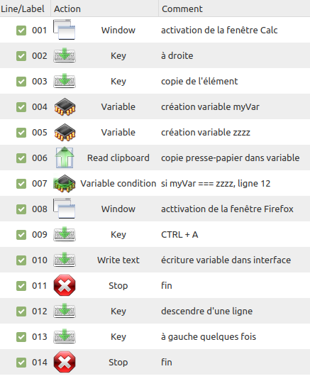

# Actiona/Actionaz Aide-Mémoire (cheat sheet) With A WooCommerce Script

A simple script in Actiona.

## Installing Actiona/Actionaz on Linux Mint

    sudo apt-get install actiona

To find out what version you are running (or whether or not Actiona/Actionaz is installed on your system), type:

    actiona --version

## What You Should Know

This script copies and pastes the content of a LibreOffice Calc spreadsheet named into fields of a WooCommerce product form. To work properly, this script needs:

- an open **Firefox tab**, with the Add new product form in it
- a **LibreOffice Calc** spreadsheet **produits.ods**, where:
    - the first column is empty
    - each row of the last column contains the string **zzzz** (this is how the script knows it has reached the end of the line)

Please refer to the included LibreOffice Calc spreadsheet as an example.

## How To Use This Script

Assuming all of the above is taken into account, you should:

1. Place your cursor where information needs to be pasted in the WooCommerce form.
2. Place your cursor at the very left of the row where you need to start in your spreadsheet (typically the upper left corner of your spreadsheet)
3. Start the script using the red cogwheel icon in the Actiona/Actionaz interface or, more conveniently, using the Actionaz hotkey (Tools ===> Settings ===> Start/Stop execution hotkey)

## Adapting This Script To Another Task

This script could easily be adapted to another similar task where you need to copy and paste data from a spreadsheet into a web browser form.

All you need to do is to make sure the names of your Firefox and spreadsheet windows in Actiona/Actionaz match whatever you have so the right window is set to the foreground at the right time.